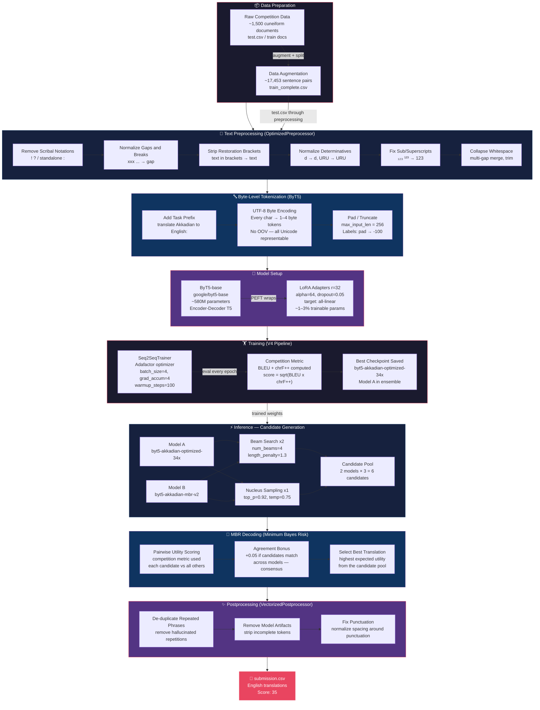

# 🏛️ Akkadian → English Neural Machine Translation

<div align="center">

[](https://www.kaggle.com/)
[](./akkadian_final/)
[-orange?style=for-the-badge)]()
[](https://huggingface.co/google/byt5-base)

**Machine translation of Akkadian cuneiform transliterations into English — one of the world's oldest written languages.**

</div>

---

## 📖 What Is This?

This repository contains the full solution for the **Deep Past Initiative — Machine Translation (Akkadian → English)** Kaggle competition.

**Akkadian** is a 4,000-year-old Semitic language written in cuneiform script. Translating it is uniquely challenging because:

- The language has been dead for ~2,000 years — no modern speakers exist
- Training data is extremely scarce (~1,500 ancient documents, ~17K augmented pairs)
- Transliterations contain specialized scholarly notation: `[broken text]`, `(d)divine`, subscripts `₁₂₃`
- Heavy morphological complexity with diacritics: `š`, `ṭ`, `ā`, `ḫ`, `ṣ`

The solution fine-tunes **Google's ByT5-base** (byte-level T5) with **LoRA r=32** and uses a **2-model ensemble with Minimum Bayes Risk (MBR) decoding** to achieve a competition score of **35** on the `√(BLEU × chrF++)` metric.

---

## 🗂️ Repository Structure

```
kaggle/
├── README.md                              ← You are here (GitHub root)
└── akkadian_final/
    ├── README.md                          ← Detailed folder README
    ├── docs/
    │   └── walkthrough.md                 ← Complete code walkthrough (~1050 lines)
    ├── training/
    │   └── akkadian_v4_full_pipeline.py   ← Full training script (ByT5 + LoRA r=32)
    ├── inference/
    │   ├── akkadian-35-ensemble.ipynb     ← Ensemble submission notebook
    │   ├── ensemble_config_v5.py          ← EnsembleConfig dataclass
    │   └── inference_explain.docx         ← Inference explanation document
    └── model/
        ├── model.safetensors              ← Trained weights (2.3 GB)
        ├── config.json                    ← ByT5 architecture config
        ├── generation_config.json         ← Decoding parameters
        ├── tokenizer_config.json          ← Tokenizer config
        ├── special_tokens_map.json        ← Special token definitions
        └── added_tokens.json              ← Extra tokens
```

---

## 🔄 Complete Pipeline Flowchart



---

## 🔬 Key Technical Decisions

| Decision | Choice | Rationale |
|:---|:---|:---|
| **Base model** | `google/byt5-base` (byte-level) | Handles Akkadian diacritics (`š`, `ṭ`, `ā`, `ḫ`) natively — no OOV issues; SentencePiece vocabs were never trained on Akkadian |
| **Fine-tuning strategy** | LoRA r=32, α=64, `target: all-linear` | Parameter-efficient (~1–3% trainable); prevents overfitting on only 17K examples; faster training |
| **Preprocessing** | Regex normalization of scholarly markup | Consistent train/inference preprocessing is critical; raw transliterations contain `[xxx]`, `(d)`, `₁₂₃` that confuse models |
| **Ensemble** | 2-model (+ optional 3rd) | Independent models make different errors; consensus via MBR improves translation quality |
| **Candidate selection** | Competition-aware MBR utility | Uses the exact same metric (`√(BLEU × chrF++)`) as the leaderboard — direct optimization target |
| **Optimizer** | Adafactor | Memory-efficient alternative to Adam; fits within Kaggle GPU VRAM limits for large seq2seq models |
| **Gap normalization** | All gap variants → `<gap>` | Cuneiform tablets are broken — `[xxx]`, `[...]`, `…` all mean the same thing; single token teaches model consistently |
| **V4 vs V5** | V4 kept (35 vs 34.3) | V5 3-model ensemble scored slightly lower on leaderboard — V4 is the submitted solution |

---

## 📊 Score Progression

| Version | Strategy | Score |
|:---|:---|:---:|
| Baseline | Raw ByT5-base, no preprocessing | ~20 |
| V2 | ByT5 + basic cleaning | ~26 |
| V3 | ByT5 + LoRA, augmented data | ~30 |
| **V4** | **ByT5 + LoRA r=32 + 2-model MBR ensemble** | **35 ✅** |
| V5 | 3-model ensemble | 34.3 (slightly worse) |

---

## 🚀 How to Reproduce

### Step 1 — Training (optional, model weights included)

```bash
# Upload to Kaggle:
# 1. train_complete.csv as a Kaggle dataset (ushreyas14/akkadian-tokens)
# 2. Create a GPU notebook on Kaggle
# 3. Run akkadian_final/training/akkadian_v4_full_pipeline.py
```

Key hyperparameters used:

| Param | Value |
|:---|:---|
| `base_model` | `google/byt5-base` |
| `LoRA r` | 32 |
| `LoRA alpha` | 64 |
| `LoRA dropout` | 0.05 |
| `target_modules` | `all-linear` |
| `learning_rate` | `5e-4` |
| `batch_size` | 4 |
| `grad_accum_steps` | 4 |
| `epochs` | 10 |
| `max_input_len` | 256 |
| `max_target_len` | 256 |
| `optimizer` | Adafactor |
| `train_size` | ~15,700 pairs |
| `eval_size` | ~1,745 pairs |

### Step 2 — Inference / Submission

1. Upload `akkadian_final/model/` to Kaggle as a dataset
2. Attach **Model B** (`mattiaangeli/byt5-akkadian-mbr-v2`) as a Kaggle model
3. Attach the competition dataset (`deep-past-initiative-machine-translation`)
4. Create a notebook from `akkadian_final/inference/akkadian-35-ensemble.ipynb`
5. Run all cells → generates `submission.csv`
6. Submit to competition

---

## 🧩 Component Deep-Dives

### `OptimizedPreprocessor` — Why preprocessing matters

Raw Akkadian transliterations look like:

```
a-na {d}Marduk be-[li]-ia₁ [ša₂] it-ta-al-ku₃
```

After preprocessing:

```
a-na {d}Marduk be-li-ia1 <gap> sha2 it-ta-al-ku3
```

The model never sees `[`, `]`, subscript Unicode — only clean normalized text. This consistency between training and inference is critical for performance.

### `MBR Decoding` — Smarter than greedy/beam

Standard beam search picks the single most likely sequence. MBR instead:
1. Generates a **pool of candidates** (beam + stochastic sampling from 2 models)
2. Scores every candidate against every other candidate using `√(BLEU × chrF++)`
3. Picks the candidate with the **highest expected utility** — i.e., the one that's most "consensus-like" across all candidates

This is especially powerful for low-resource languages where beam search tends to produce degenerate repetitive outputs.

### `ByT5 Byte-Level Tokenization` — No OOV ever

```
Akkadian char: š  →  UTF-8 bytes: [0xC5, 0xA1]  →  ByT5 token IDs: [197, 161]
```

Every possible Unicode character can be represented as 1–4 bytes. The model operates on these bytes directly — no vocabulary lookup tables, no unknown tokens.

---

## 📁 File Reference

| File | Purpose |
|:---|:---|
| [`training/akkadian_v4_full_pipeline.py`](./akkadian_final/training/akkadian_v4_full_pipeline.py) | Full training script: data loading, preprocessing, LoRA setup, training loop, metric computation |
| [`inference/akkadian-35-ensemble.ipynb`](./akkadian_final/inference/akkadian-35-ensemble.ipynb) | Submission notebook: load 2 models, generate candidates, MBR selection, postprocess, save CSV |
| [`inference/ensemble_config_v5.py`](./akkadian_final/inference/ensemble_config_v5.py) | `EnsembleConfig` dataclass with all inference hyperparameters |
| [`docs/walkthrough.md`](./akkadian_final/docs/walkthrough.md) | ~1,050-line detailed walkthrough of every code component with explanations |
| [`model/`](./akkadian_final/model/) | Pre-trained `byt5-akkadian-optimized-34x` weights (Model A in ensemble) |

---

## 🏆 Competition Context

**Deep Past Initiative** is a Kaggle competition focused on machine translation of **low-resource ancient languages**. The competition provides:
- ~1,500 cuneiform documents (Akkadian source + English reference)
- `test.csv` with Akkadian transliterations to translate
- Evaluation metric: `√(BLEU × chrF++)` — geometric mean of token-level and character-level metrics

The geometric mean is chosen because BLEU rewards word-level accuracy while chrF++ captures morphological similarity — both important for translating a heavily inflected ancient language.

---

## 📚 Key References

- [ByT5: Towards a Token-Free Future with Pre-trained Byte-to-Byte Models](https://arxiv.org/abs/2105.13626) — Xue et al., 2022
- [LoRA: Low-Rank Adaptation of Large Language Models](https://arxiv.org/abs/2106.09685) — Hu et al., 2021
- [Minimum Bayes Risk Decoding for Neural Machine Translation](https://aclanthology.org/2022.findings-acl.38/) — Freitag et al., 2022
- [chrF: character n-gram F-score for automatic MT evaluation](https://aclanthology.org/W15-3049/) — Popović, 2015
- [PEFT Library](https://github.com/huggingface/peft) — Hugging Face

---

<div align="center">

**Built with ❤️ for the Deep Past Initiative | Score: 35 | ByT5 + LoRA + MBR**

</div>
