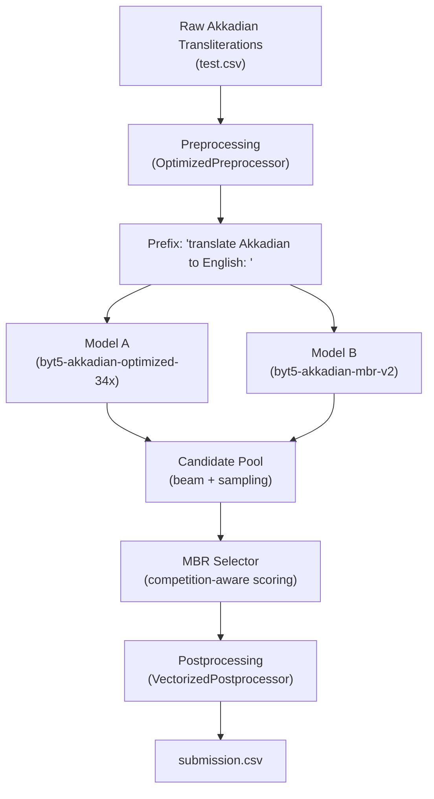
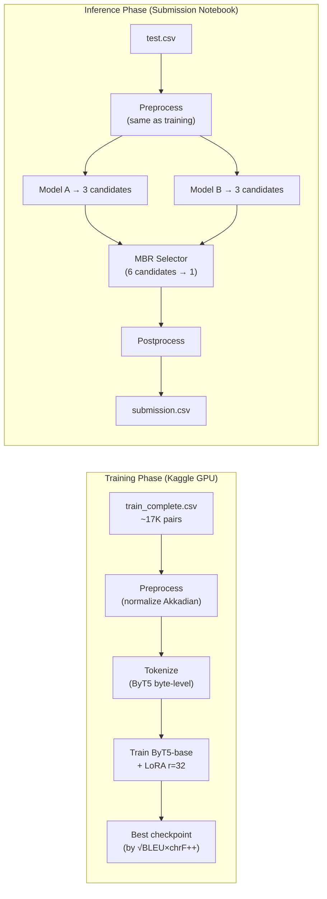

# Akkadian Translation Model — Complete Detailed Walkthrough

> **Competition**: Deep Past Initiative — Machine Translation (Akkadian → English)  
> **Final Score**: **34.4** (metric: `√(BLEU × chrF++)`)  
> **Architecture**: 2-model ensemble + MBR decoding (V4 training pipeline; V5 scored 34.3 so V4 is kept)

---

## 1. High-Level Architecture



The system has **two main parts**:
1. **Training Pipeline** (`akkadian_v4_full_pipeline.py`) — fine-tunes a ByT5-base model on augmented Akkadian data using LoRA
2. **Ensemble Inference** (`akkadian-35` notebook) — combines multiple models via Minimum Bayes Risk (MBR) decoding to pick the best translation

---

## 2. Training Pipeline (V4 — the 34.4 model)

### 2.1 Imports & Environment Setup

```python
import bitsandbytes as bnb
import pandas as pd
import torch
import os, re, shutil
import numpy as np
import evaluate
from datasets import Dataset, DatasetDict, load_from_disk
from transformers import (
    AutoTokenizer,
    T5ForConditionalGeneration,
    Seq2SeqTrainingArguments,
    Seq2SeqTrainer,
    DataCollatorForSeq2Seq,
    EarlyStoppingCallback,
)
from peft import LoraConfig, get_peft_model, TaskType
from tqdm import tqdm

os.environ["PYTORCH_CUDA_ALLOC_CONF"] = "expandable_segments:True"
```

**What each import does:**
- `bitsandbytes` — enables 8-bit optimizers (memory-efficient training on GPU)
- `pandas` — data loading and manipulation
- `torch` — PyTorch deep learning framework
- `evaluate` — Hugging Face metrics library (BLEU, chrF++)
- `datasets` — Hugging Face dataset library for efficient data handling
- `transformers` — Hugging Face model library (T5, tokenizers, training utilities)
- `peft` — Parameter-Efficient Fine-Tuning library (LoRA implementation)

**`PYTORCH_CUDA_ALLOC_CONF = "expandable_segments:True"`** — tells PyTorch's CUDA memory allocator to use expandable memory segments instead of fixed blocks. This reduces memory fragmentation on the GPU, preventing out-of-memory errors when dealing with variable-length sequences.

```python
MODEL_NAME = "google/byt5-base"
DEVICE = "cuda" if torch.cuda.is_available() else "cpu"
```

Sets the base model to Google's ByT5-base and automatically uses GPU if available, otherwise falls back to CPU.

---

### 2.2 Data Loading & Augmentation

```python
AUGMENTED_CSV = "/kaggle/input/datasets/ushreyas14/akkadian-tokens/train_complete.csv"
TEST_PATH = "/kaggle/input/competitions/deep-past-initiative-machine-translation/test.csv"
```

| Parameter | Value |
|---|---|
| Dataset | `train_complete.csv` (~17,453 augmented sentence pairs) |
| Source | Augmented from the original ~1,500 competition documents |
| Split | 90% train / 10% eval (shuffled, seed=42) |
| Min length filter | Both transliteration and translation must have >2 characters |

```python
USE_CSV = os.path.exists(AUGMENTED_CSV)

if USE_CSV:
    train_df = pd.read_csv(AUGMENTED_CSV)

    # Apply preprocessing
    train_df['transliteration'] = train_df['transliteration'].apply(preprocess_transliteration)
    train_df['translation'] = train_df['translation'].apply(preprocess_translation)

    # Drop rows with trivially short text
    train_df = train_df[
        (train_df['transliteration'].str.len() > 2) &
        (train_df['translation'].str.len() > 2)
    ].reset_index(drop=True)

    # Shuffle and split 90/10
    train_df = train_df.sample(frac=1, random_state=42).reset_index(drop=True)
    split_idx = int(0.9 * len(train_df))
    eval_df = train_df.iloc[split_idx:].reset_index(drop=True)
    train_df = train_df.iloc[:split_idx].reset_index(drop=True)
```

**Line-by-line:**
1. **`os.path.exists(AUGMENTED_CSV)`** — checks if the augmented CSV exists; if not, falls back to pre-tokenized data
2. **`pd.read_csv(AUGMENTED_CSV)`** — loads the CSV with columns: `transliteration` (Akkadian) and `translation` (English)
3. **`.apply(preprocess_transliteration)`** — applies text normalization to every Akkadian text (detailed below)
4. **`.apply(preprocess_translation)`** — cleans English translations
5. **Length filter** — removes rows where either side is ≤2 characters (junk data)
6. **`.sample(frac=1, random_state=42)`** — shuffles the entire dataframe with a fixed seed for reproducibility
7. **`int(0.9 * len(train_df))`** — calculates 90% split point
8. **`iloc[split_idx:]`** / **`iloc[:split_idx]`** — splits into eval (last 10%) and train (first 90%)

---

### 2.3 Preprocessing Functions — Cleaning Akkadian Transliterations

This is one of the most important parts of the pipeline. Akkadian transliterations contain many modern scholarly conventions (brackets, determinatives, subscripts) that aren't part of the actual language content.

```python
def preprocess_transliteration(text):
    if not isinstance(text, str):
        return str(text) if pd.notna(text) else ""
    s = text
```

**Guard clause** — handles non-string inputs (NaN, None, numbers) gracefully.

#### Step 1: Remove Scribal Notations

```python
    # 1. Remove scribal notations (modern editorial marks)
    s = re.sub(r'[!?]', '', s)       # Remove ! and ? (certainty markers)
    s = re.sub(r'/', ' ', s)          # Replace / with space (line dividers)
    s = re.sub(r'(?<!\w):(?!\w)', ' ', s)  # Remove colons not inside words
```

- **`!`** in Akkadian transliteration means "reading certain" — it's a modern editor's note, not ancient text
- **`?`** means "reading uncertain" — again, modern markup
- **`/`** typically divides lines on a tablet — we replace with space since the meaning flows across
- **`(?<!\w):(?!\w)`** — uses negative lookbehind/lookahead to only remove standalone colons (not colons in the middle of words like `a:na`)

#### Step 2: Standardize Gaps and Breaks

```python
    # 2. Standardize gaps and breaks
    s = re.sub(r'\[x+\]', '<gap>', s)     # [xxx] → <gap>
    s = re.sub(r'\[\.\.\.\]', '<gap>', s)  # [...] → <gap>
    s = re.sub(r'\[…\]', '<gap>', s)       # […] → <gap>
    s = re.sub(r'\.\.\.', '<gap>', s)      # ... → <gap>
    s = re.sub(r'…', '<gap>', s)           # … → <gap>
```

Cuneiform tablets are often broken. Scholars mark missing text in various ways (`[xxx]`, `[...]`, `…`). We normalize **all** gap representations to a single `<gap>` token so the model learns one consistent representation for "text is missing here."

#### Step 3: Remove Brackets

```python
    # 3. Remove brackets and parentheses (restoration marks)
    s = re.sub(r'\[([^\]]*)\]', r'\1', s)  # [restored text] → restored text
    s = re.sub(r'\(([^)]*)\)', r'\1', s)   # (uncertain text) → uncertain text
```

- **`[text]`** in Assyriology means "text was restored/reconstructed by the scholar"
- **`(text)`** means "text was partially readable"
- We strip the brackets but keep the content — the actual words matter, not the scholarly certainty markup
- **`r'\1'`** is a regex backreference that outputs just the captured group (the text inside brackets)

#### Step 4: Normalize Determinatives

```python
    # 4. Normalize determinatives
    for det in ['d', 'f', 'm', 'ki', 'URU', 'KUR', 'DINGIR', 'LU', 'LU2',
                'MUNUS', 'GIS', 'TUG', 'KU3', 'AN', 'NA4']:
        s = re.sub(rf'\({det}\)', '{' + det + '}', s, flags=re.IGNORECASE)
```

**Determinatives** are Sumerian logograms that classify the following word:
- `(d)` before a god's name = "divine" (e.g., `(d)Marduk` → `{d}Marduk`)
- `(URU)` = city name follows
- `(KUR)` = country/land name follows
- `(DINGIR)` = divine name follows

We convert `(d)` → `{d}` to distinguish determinatives from other parenthetical content (which was stripped in step 3). The curly braces are a consistent marker.

#### Step 5-6: Normalize Sub/Superscripts

```python
    # 5. Normalize subscripts  (₀₁₂₃₄₅₆₇₈₉ → 0123456789)
    subscript_map = str.maketrans('₀₁₂₃₄₅₆₇₈₉', '0123456789')
    s = s.translate(subscript_map)

    # 6. Normalize superscripts (⁰¹²³⁴⁵⁶⁷⁸⁹ → 0123456789)
    superscript_map = str.maketrans('⁰¹²³⁴⁵⁶⁷⁸⁹', '0123456789')
    s = s.translate(superscript_map)
```

Akkadian signs are often numbered with subscripts to distinguish homophonic signs (signs that sound the same but look different). For example, `du₃` and `du₆` are different cuneiform signs. We convert these Unicode subscript/superscript characters to regular ASCII digits so the model's byte-level tokenizer handles them uniformly.

**`str.maketrans()`** creates a character translation table, and **`.translate()`** applies it in a single O(n) pass — much faster than repeated `.replace()` calls.

#### Step 7: Final Cleanup

```python
    # 7. Collapse whitespace
    s = re.sub(r'(<gap>\s*)+', '<gap> ', s)  # Multiple gaps → single gap
    s = re.sub(r'\s+', ' ', s)                # Multiple spaces → single space
    return s.strip()
```

Final cleanup: consecutive gaps are merged into one (since "3 broken sections" vs "1 broken section" doesn't change the meaning for translation), and all extra whitespace is collapsed.

#### English Translation Preprocessing

```python
def preprocess_translation(text):
    if not isinstance(text, str):
        return str(text) if pd.notna(text) else ""
    s = text.strip()
    s = re.sub(r'\[?\.\.\.?\]?', '...', s)  # Normalize ellipsis variants
    s = re.sub(r'\s+', ' ', s)               # Collapse whitespace
    return s.strip()
```

Much simpler — just normalizes ellipsis formats and collapses whitespace. English translations are already mostly clean.

---

### 2.4 Base Model: ByT5-base

```python
MODEL_NAME = "google/byt5-base"
model = T5ForConditionalGeneration.from_pretrained(MODEL_NAME).to(DEVICE)
```

| Property | Value |
|---|---|
| Model | `google/byt5-base` (~580M parameters) |
| Type | Encoder-decoder (T5 architecture) |
| Tokenization | **Byte-level** — operates on raw UTF-8 bytes, not subwords |

**Why ByT5 instead of regular T5 or mT5?**

Regular T5 uses a **SentencePiece tokenizer** that breaks text into subwords. This tokenizer was trained on English/multilingual data and has **never seen Akkadian**. Rare characters like `š`, `ṭ`, `ā`, `ḫ` would be split into unknown or character-level tokens unpredictably.

ByT5 skips the tokenizer entirely and operates on **raw UTF-8 bytes**. Every character is represented as 1-4 bytes:
- ASCII letters (`a-z`): 1 byte each
- Accented letters (`á`, `š`): 2 bytes each
- Special symbols: 2-4 bytes each

**Trade-offs:**
- ✅ No out-of-vocabulary issues — every possible character is representable
- ✅ Can learn character-level patterns (crucial for Akkadian morphology)
- ❌ Sequences are 3-4× longer than subword tokenization → needs more memory and compute

```python
tokenizer = AutoTokenizer.from_pretrained(MODEL_NAME)
```

The ByT5 tokenizer is trivial — it just converts each character to its UTF-8 byte values. There's no learned vocabulary.

---

### 2.5 LoRA (Low-Rank Adaptation)

```python
model.enable_input_require_grads()

peft_config = LoraConfig(
    task_type=TaskType.SEQ_2_SEQ_LM,   # Sequence-to-sequence language model
    inference_mode=False,                # Training mode (not frozen)
    r=32,                                # Rank of the low-rank matrices
    lora_alpha=64,                       # Scaling factor (2× rank is standard)
    lora_dropout=0.05,                   # 5% dropout on LoRA layers
    target_modules="all-linear",         # Apply LoRA to ALL linear layers
)
model = get_peft_model(model, peft_config)
model.print_trainable_parameters()
```

**What is LoRA?**

Instead of fine-tuning all ~580M parameters of ByT5, LoRA **freezes** the original weights and injects small trainable matrices alongside each linear layer.

For a weight matrix `W` of shape `(d_out, d_in)`:

```
Original:     output = W × input
With LoRA:    output = W × input + (α/r) × B × A × input
```

Where:
- `A` has shape `(r, d_in)` — "compress" the input to rank `r`
- `B` has shape `(d_out, r)` — "expand" back to output dimension
- `r = 32` means each adapted layer adds only `32 × (d_in + d_out)` parameters
- `α = 64` scales the LoRA contribution (effectively `α/r = 2.0` scaling)

**Line-by-line:**
- **`model.enable_input_require_grads()`** — needed because LoRA freezes the base model, but we still need gradients to flow through the frozen layers for LoRA to train
- **`task_type=TaskType.SEQ_2_SEQ_LM`** — tells PEFT this is a seq2seq model (adjusts which layers to target)
- **`r=32`** — rank of low-rank matrices. Higher rank = more parameters = more capacity but more overfitting risk
- **`lora_alpha=64`** — scaling factor. Convention is `alpha = 2 × r`
- **`lora_dropout=0.05`** — randomly zeros 5% of LoRA activations during training (regularization)
- **`target_modules="all-linear"`** — applies LoRA to every `nn.Linear` layer in both encoder and decoder (attention Q/K/V projections, feed-forward layers, etc.)
- **`get_peft_model()`** — wraps the original model with LoRA adapters, freezing original weights

**Result:** Only ~1-3% of parameters are trainable, yet the model can learn task-specific behavior. `print_trainable_parameters()` shows the exact count.

---

### 2.6 Tokenization for Training

```python
PREFIX = "translate Akkadian to English: "
MAX_INPUT_LEN = 256
MAX_TARGET_LEN = 256

def tokenize_df(df):
    inputs = [PREFIX + str(t) for t in df['transliteration']]
    targets = [str(t) for t in df['translation']]

    model_inputs = tokenizer(
        inputs, max_length=MAX_INPUT_LEN,
        padding="max_length", truncation=True,
    )
    labels = tokenizer(
        targets, max_length=MAX_TARGET_LEN,
        padding="max_length", truncation=True,
    )
    model_inputs["labels"] = [
        [-100 if t == tokenizer.pad_token_id else t for t in ids]
        for ids in labels["input_ids"]
    ]
    return model_inputs
```

**Line-by-line:**
1. **`PREFIX + str(t)`** — prepends task instruction. T5 models use text prefixes to specify the task. Example: `"translate Akkadian to English: a-na {d}Marduk"`. This tells the model "your job is translation."

2. **`tokenizer(inputs, max_length=256, padding="max_length", truncation=True)`** — converts text to byte-level token IDs:
   - Each character → 1-4 byte tokens
   - Pad with `pad_token_id` (=0) to exactly 256 tokens
   - Truncate if longer than 256 tokens
   - Returns `input_ids` and `attention_mask`

3. **`labels` tokenization** — same process for English targets

4. **`[-100 if t == tokenizer.pad_token_id else t for t in ids]`** — **critical step**: replaces padding tokens in labels with `-100`. PyTorch's `CrossEntropyLoss` ignores positions with label `-100`, so the model isn't penalized for not predicting padding tokens. Without this, the model would waste capacity learning to predict padding.

```python
train_dataset = Dataset.from_dict(tokenize_df(train_df))
eval_dataset = Dataset.from_dict(tokenize_df(eval_df))
```

Wraps the tokenized data into Hugging Face `Dataset` objects for efficient batching by the trainer.

---

### 2.7 Metrics: Competition Score Computation

```python
bleu_metric = evaluate.load("sacrebleu")
chrf_metric = evaluate.load("chrf")

def compute_metrics(eval_preds):
    preds, labels = eval_preds

    # Handle different prediction formats
    if isinstance(preds, tuple):
        preds = preds[0]
    if isinstance(preds, np.ndarray) and len(preds.shape) == 3:
        preds = np.argmax(preds, axis=-1)   # logits → token IDs
```

The trainer can return predictions in different formats:
- **Tuple**: `(logits, hidden_states)` — take first element
- **3D array** `(batch, seq_len, vocab_size)`: these are logits — take `argmax` to get token IDs
- **2D array** `(batch, seq_len)`: already token IDs (when `predict_with_generate=True`)

```python
    # Sanitize prediction token IDs
    preds = np.where(preds > 1114114, tokenizer.pad_token_id, preds)
    preds = np.where(preds < 0, tokenizer.pad_token_id, preds)
```

ByT5's byte vocabulary goes up to Unicode codepoint 1,114,114. Any ID outside this range is garbage — replace with padding.

```python
    # Decode byte IDs back to text
    decoded_preds = tokenizer.batch_decode(preds, skip_special_tokens=True)
    labels = np.where(labels != -100, labels, tokenizer.pad_token_id)
    decoded_labels = tokenizer.batch_decode(labels, skip_special_tokens=True)

    decoded_preds = [pred.strip() for pred in decoded_preds]
    decoded_labels_flat = [label.strip() for label in decoded_labels]
    decoded_labels_nested = [[label] for label in decoded_labels_flat]
```

- **`batch_decode()`** — converts byte token IDs back to human-readable text
- **`labels != -100`** — reverses the `-100` masking we did during tokenization (replace `-100` back to padding for decoding)
- **`decoded_labels_nested`** — BLEU expects references as `[[ref1], [ref2], ...]` (list of lists, supporting multiple references per example)

```python
    # Compute BLEU
    bleu_result = bleu_metric.compute(
        predictions=decoded_preds, references=decoded_labels_nested
    )
    # Compute chrF++ (word_order=2 makes it chrF++ not chrF)
    chrf_result = chrf_metric.compute(
        predictions=decoded_preds, references=decoded_labels_flat,
        word_order=2,
    )
```

- **BLEU (BiLingual Evaluation Understudy)** — measures how many n-grams (1-gram through 4-gram) in the prediction also appear in the reference. Precision-focused.
- **chrF++ (Character n-gram F-score ++)** — measures character-level n-gram overlap PLUS word-level bigrams (`word_order=2`). More forgiving than BLEU for morphologically rich languages.

```python
    bleu_score = bleu_result["score"]
    chrf_score = chrf_result["score"]
    comp_score = np.sqrt(max(bleu_score, 0) * max(chrf_score, 0))
```

**Competition score** = `√(BLEU × chrF++)` — the geometric mean. This is what the Kaggle leaderboard uses. It ensures:
- You can't get a high score by gaming just one metric
- Both word-level accuracy (BLEU) and character-level accuracy (chrF++) matter
- `max(..., 0)` prevents negative values from crashing the `sqrt`

---

### 2.8 Training Configuration

```python
training_args = Seq2SeqTrainingArguments(
    output_dir=OUTPUT_DIR,

    per_device_train_batch_size=16,       # 16 samples per GPU per step
    per_device_eval_batch_size=4,          # smaller for eval (saves memory)
    gradient_accumulation_steps=2,         # accumulate 2 steps → effective batch = 32
    gradient_checkpointing=True,           # trade compute for memory
    dataloader_num_workers=0,              # single-threaded (Kaggle stability)

    predict_with_generate=True,            # use model.generate() during eval
    generation_max_length=256,             # max output tokens during eval
    generation_num_beams=4,                # 4-beam search during eval

    eval_strategy="steps",
    eval_steps=200,                        # evaluate every 200 training steps
    save_steps=200,                        # save checkpoint every 200 steps
    load_best_model_at_end=True,           # restore best checkpoint after training
    metric_for_best_model="competition_score",  # select best by competition metric
    greater_is_better=True,
    save_total_limit=3,                    # keep only 3 most recent checkpoints

    num_train_epochs=10,                   # 10 full passes over training data
    label_smoothing_factor=0.05,           # soften target distribution

    optim="adafactor",                     # memory-efficient optimizer
    learning_rate=3e-4,                    # higher LR for LoRA
    lr_scheduler_type="cosine",            # cosine decay schedule
    warmup_ratio=0.10,                     # 10% warmup
    weight_decay=0.01,                     # L2 regularization

    fp16=True,                             # half-precision training
    max_grad_norm=1.0,                     # gradient clipping
    ddp_find_unused_parameters=False,
    eval_accumulation_steps=1,
    logging_steps=50,
    report_to="none",
)
```

**Key parameters explained:**

| Parameter | Value | What it does |
|---|---|---|
| `gradient_accumulation_steps=2` | Effective batch = 16×2 = 32 | Simulates larger batch without more memory. Gradients from 2 mini-batches are summed before updating weights. |
| `gradient_checkpointing=True` | Trades speed for memory | Instead of storing all intermediate activations for backprop, recomputes them on-the-fly. Uses ~60% less memory at ~20% speed cost. |
| `predict_with_generate=True` | Uses autoregressive generation for eval | Without this, eval only computes loss. With it, the model actually generates translations and we can compute BLEU/chrF++. |
| `label_smoothing_factor=0.05` | Soft targets | Instead of target distribution being 100% on the correct token, it's 95% correct + 5% spread across all tokens. Prevents overconfidence and improves generalization. |
| `optim="adafactor"` | Adaptive learning rate per parameter | Memory-efficient alternative to Adam. Doesn't store second-moment estimates, saving ~33% optimizer memory. Works especially well with T5 models. |
| `learning_rate=3e-4` | Higher than standard fine-tuning | LoRA's low-rank matrices need higher learning rates because they start from zero (random init). Full fine-tuning uses 1e-5 to 5e-5. |
| `lr_scheduler_type="cosine"` | LR follows cosine curve | Starts at 3e-4, gradually decays to near 0 following a cosine shape. Gentler than linear decay, gives more time at moderate LR. |
| `warmup_ratio=0.10` | 10% of steps at increasing LR | LR ramps linearly from 0 to 3e-4 during the first 10% of training. Prevents explosive gradients at the start. |
| `fp16=True` | Float16 training | Uses 16-bit floats instead of 32-bit. Halves memory usage, doubles throughput on modern GPUs. |
| `max_grad_norm=1.0` | Gradient clipping | If the total gradient norm exceeds 1.0, all gradients are scaled down proportionally. Prevents training instability from exploding gradients. |

---

### 2.9 Trainer & Training Loop

```python
trainer = Seq2SeqTrainer(
    model=model,
    args=training_args,
    train_dataset=train_dataset,
    eval_dataset=eval_dataset,
    data_collator=data_collator,
    compute_metrics=compute_metrics,
    callbacks=[EarlyStoppingCallback(early_stopping_patience=5)],
)

torch.cuda.empty_cache()
trainer.train()
```

- **`Seq2SeqTrainer`** — Hugging Face's training loop for sequence-to-sequence models. Handles batching, gradient computation, optimizer steps, evaluation, checkpointing, and logging automatically.
- **`data_collator=DataCollatorForSeq2Seq`** — dynamically pads batches to the longest sequence in each batch (more efficient than pre-padding to max length).
- **`EarlyStoppingCallback(patience=5)`** — monitors `competition_score` on the eval set. If it doesn't improve for 5 consecutive evaluations (5 × 200 = 1000 steps), training stops early. This prevents overfitting.
- **`torch.cuda.empty_cache()`** — frees unused GPU memory before training starts.

**What happens during each training step:**
1. Load a batch of 16 tokenized (input, label) pairs
2. Forward pass: encoder processes Akkadian bytes → hidden states; decoder generates English bytes
3. Compute cross-entropy loss between predicted token probabilities and target labels
4. Backward pass: compute gradients through LoRA parameters (base model frozen)
5. Every 2 steps: update LoRA weights using Adafactor optimizer
6. Every 200 steps: run eval, save checkpoint if best score

---

### 2.10 Saving the Model

```python
SAVE_PATH = "/kaggle/working/akkadian_v4_model"
model.save_pretrained(SAVE_PATH)
tokenizer.save_pretrained(SAVE_PATH)
```

Saves the LoRA adapter weights and tokenizer. The base ByT5 model is NOT saved (it's frozen and unchanged) — only the small LoRA matrices are stored.

> [!NOTE]
> In V4, only the adapter is saved (requires base model + PEFT to load). In V5, the LoRA weights are **merged** into the base model (`model.merge_and_unload()`) so it can be loaded as a standalone model by the ensemble.

---

### 2.11 Inference & Submission Generation (Standalone)

```python
model.eval()
predictions = []
BATCH_SIZE = 8

for i in tqdm(range(0, len(test_df), BATCH_SIZE), desc="Translating"):
    batch = test_df.iloc[i : i + BATCH_SIZE]

    # Apply SAME preprocessing as training!
    inputs = [
        PREFIX + preprocess_transliteration(str(x))
        for x in batch["transliteration"].values
    ]

    encoded = tokenizer(
        inputs, return_tensors="pt", padding=True,
        truncation=True, max_length=MAX_INPUT_LEN,
    ).to(DEVICE)

    with torch.no_grad():
        outputs = model.generate(
            **encoded,
            max_new_tokens=256,
            num_beams=4,
            length_penalty=1.0,
            early_stopping=True,
        )

    decoded = tokenizer.batch_decode(outputs, skip_special_tokens=True)
    decoded = [postprocess_prediction(p) for p in decoded]
    predictions.extend(decoded)

    del encoded, outputs
    torch.cuda.empty_cache()
```

**Line-by-line:**
1. **`model.eval()`** — disables dropout and batch normalization training behavior
2. **Batch processing** — processes 8 samples at a time to balance speed and memory
3. **Same preprocessing** — applies identical `preprocess_transliteration()` as training — this is crucial, any mismatch degrades performance
4. **`return_tensors="pt"`** — returns PyTorch tensors (not lists)
5. **`padding=True`** — pads to the longest sequence in this batch (not to max_length)
6. **`.to(DEVICE)`** — moves tensors to GPU
7. **`torch.no_grad()`** — disables gradient computation (saves memory during inference)
8. **`model.generate()`** — autoregressive generation:
   - **`num_beams=4`** — beam search with 4 beams (explores 4 hypotheses in parallel)
   - **`length_penalty=1.0`** — no preference for shorter/longer outputs
   - **`early_stopping=True`** — stop when all beams have produced an end token
   - No `repetition_penalty` or `no_repeat_ngram_size` — these hurt low-resource translation
9. **`del encoded, outputs; torch.cuda.empty_cache()`** — manually free GPU memory between batches to prevent OOM

#### Post-Processing

```python
def postprocess_prediction(text):
    if not isinstance(text, str):
        return str(text) if text else ""
    s = text.strip()
    s = re.sub(r'\s+', ' ', s)           # Collapse whitespace
    s = re.sub(r'\s([.,;:!?])', r'\1', s) # " ," → ","
    if s and s[0].islower():
        s = s[0].upper() + s[1:]          # Capitalize first letter
    return s.strip()
```

Light cleanup for BLEU/chrF++ scoring:
- **Punctuation spacing** — BLEU counts n-grams, so `"king ,"` vs `"king,"` changes the n-gram counts
- **Capitalization** — reference translations typically start with uppercase

---

## 3. Ensemble Inference Pipeline (the 34.4 submission)

The ensemble notebook (`akkadian-35`) is where the actual 34.4 score comes from. It combines **two pre-trained models** and picks the best translation using MBR decoding.

### 3.1 Configuration

```python
@dataclass
class EnsembleConfig:
    model_a_path: str = "/kaggle/input/.../byt5-akkadian-optimized-34x"
    model_b_path: str = "/kaggle/input/.../byt5-akkadian-mbr-v2/pytorch/default/1"

    max_input_length: int = 512
    max_new_tokens: int = 256
    batch_size: int = 4

    # Beam search settings
    num_beam_cands: int = 2       # Return top-2 from beam search
    num_beams: int = 4            # Use 4 beams
    length_penalty: float = 1.3   # Slightly prefer longer outputs
    early_stopping: bool = True
    repetition_penalty: float = 1.2

    # Stochastic sampling settings
    num_sample_cands: int = 1     # 1 random sample per model
    mbr_top_p: float = 0.92       # Nucleus sampling threshold
    mbr_temperature: float = 0.75 # Sharpened distribution
    mbr_pool_cap: int = 36        # Max unique candidates for MBR

    agreement_bonus: float = 0.035  # Bonus for consensus translations
    use_competition_utility: bool = True
```

| Setting | What it controls |
|---|---|
| `num_beams=4` | Beam search width — explores 4 hypotheses simultaneously |
| `num_beam_cands=2` | Returns top-2 (not just top-1) from beam search |
| `num_sample_cands=1` | One additional stochastic sample for diversity |
| `length_penalty=1.3` | Scores are divided by `length^1.3` — mildly prefers longer outputs |
| `repetition_penalty=1.2` | Reduces probability of tokens that already appeared |
| `mbr_top_p=0.92` | Nucleus sampling: only sample from tokens whose cumulative probability ≤ 92% |
| `mbr_temperature=0.75` | Temperature < 1 sharpens the distribution (more confident) |

### 3.2 Models Used

| Label | Model | Source |
|---|---|---|
| **Model A** | `byt5-akkadian-optimized-34x` | By Jeenil Makwana (competitor) — a well-tuned ByT5 |
| **Model B** | `byt5-akkadian-mbr-v2` | By Mattia Angeli (competitor) — another ByT5 variant |

Both are independently trained ByT5 models. Their different training data/hyperparameters mean they make **different mistakes** — ensemble decoding exploits this complementarity.

### 3.3 Model Loading — `ModelWrapper`

```python
class ModelWrapper:
    def __init__(self, model_path, cfg, logger, label):
        self.tokenizer = AutoTokenizer.from_pretrained(model_path, local_files_only=True)
        self.model = AutoModelForSeq2SeqLM.from_pretrained(
            model_path, local_files_only=True
        ).to(cfg.device).eval()

        if cfg.use_better_transformer and cfg.device.type == "cuda":
            try:
                from optimum.bettertransformer import BetterTransformer
                self.model = BetterTransformer.transform(self.model)
            except Exception as e:
                pass
```

- **`local_files_only=True`** — loads from disk only (no internet required in Kaggle submission)
- **`.eval()`** — puts model in inference mode
- **`BetterTransformer.transform()`** — fuses attention operations (Q, K, V projections + attention + output in one kernel) for up to 30% faster inference on GPU

### 3.4 Candidate Generation

```python
def generate_candidates(self, input_ids, attention_mask, beam_size):
    cfg = self.cfg
    bsz = int(input_ids.shape[0])
    ctx = bf16_ctx(cfg.device, cfg.use_bf16_amp)

    with ctx:
        # === BEAM SEARCH: deterministic, high-quality candidates ===
        nb = max(beam_size, cfg.num_beam_cands)
        beam_out = self.model.generate(
            input_ids=input_ids,
            attention_mask=attention_mask,
            do_sample=False,              # deterministic
            num_beams=nb,                 # 4 beams
            num_return_sequences=cfg.num_beam_cands,  # return top-2
            max_new_tokens=cfg.max_new_tokens,
            length_penalty=cfg.length_penalty,
            early_stopping=cfg.early_stopping,
            repetition_penalty=cfg.repetition_penalty,
            use_cache=True,               # KV cache for speed
        )
        beam_texts = self.tokenizer.batch_decode(beam_out, skip_special_tokens=True)

        # === STOCHASTIC SAMPLING: diverse, exploratory candidates ===
        sample_texts = []
        if cfg.num_sample_cands > 0:
            sample_out = self.model.generate(
                input_ids=input_ids,
                attention_mask=attention_mask,
                do_sample=True,           # stochastic
                num_beams=1,              # greedy base (no beam search)
                top_p=cfg.mbr_top_p,      # nucleus sampling
                temperature=cfg.mbr_temperature,
                num_return_sequences=cfg.num_sample_cands,
                max_new_tokens=cfg.max_new_tokens,
                repetition_penalty=cfg.repetition_penalty,
                use_cache=True,
            )
            sample_texts = self.tokenizer.batch_decode(sample_out, skip_special_tokens=True)

    # Combine into per-sample candidate pools
    rb = cfg.num_beam_cands   # 2
    rs = cfg.num_sample_cands # 1
    pools = []
    for i in range(bsz):
        p = list(beam_texts[i * rb:(i + 1) * rb])   # 2 beam candidates
        if rs > 0:
            p.extend(sample_texts[i * rs:(i + 1) * rs])  # 1 sample candidate
        pools.append(p)
    return pools
```

**Per model, per sample: 3 candidates** (2 from beam search + 1 from sampling)

**How beam search works (step by step):**
1. Start with 4 empty hypotheses
2. At each time step, extend each hypothesis by all possible next bytes
3. Keep only the top-4 scoring (beam × vocab → keep top 4)
4. When a beam produces `</s>` (end token), it's "finished" — stored separately
5. Continue until all beams finish or `max_new_tokens` reached
6. Return top-2 highest-scoring finished beams (`num_return_sequences=2`)

**How nucleus/top-p sampling works:**
1. Compute probability distribution over all next bytes
2. Divide probabilities by `temperature=0.75` (sharpens the distribution — makes high-prob tokens even more likely)
3. Sort tokens by probability, take the smallest set whose cumulative probability ≥ `top_p=0.92`
4. Renormalize and sample randomly from this set
5. Repeat until `</s>` or max tokens

**Why both?** Beam search finds the most "likely" translations, but can get stuck on boring outputs. Sampling adds diversity — sometimes a less likely translation is actually better.

### 3.5 MBR Selector — Picking the Best Translation

```python
class MBRSelector:
    def __init__(self, pool_cap, use_competition_utility, agreement_bonus):
        self.pool_cap = int(pool_cap)
        self.use_competition_utility = bool(use_competition_utility)
        self.agreement_bonus = float(agreement_bonus)
```

MBR (Minimum Bayes Risk) decoding selects the candidate with the **highest expected utility** — i.e., the one that is most similar to all other candidates on average.

**Intuition:** If multiple independent models/decoding strategies produce similar translations, that translation is probably correct. MBR formalizes this intuition.

#### Deduplication with counts:

```python
    @staticmethod
    def dedup_with_counts(xs):
        counts = {}
        order = []
        for x in xs:
            t = str(x or "").strip()
            if not t:
                continue
            if t not in counts:
                order.append(t)
                counts[t] = 0
            counts[t] += 1
        return order, counts
```

If beam search from Model A produces "The king spoke" and beam search from Model B also produces "The king spoke," that's counted as 2 occurrences. This ordering preserves the first-seen order.

#### Utility Function (Competition-Aware):

```python
    def utility(self, a, b):
        if self.use_competition_utility:
            bleu = sentence_bleu_smoothed(a, b)
            chrf = sentence_chrfpp(a, b)
            if bleu <= 0 or chrf <= 0:
                return 0.0
            return float(math.sqrt(bleu * chrf))
        return sentence_chrfpp(a, b)
```

The utility function measures how similar two translations are. Since the competition uses `√(BLEU × chrF++)`, the MBR selector uses the **same metric** — this aligns candidate selection with what the leaderboard rewards.

#### The Pick Algorithm:

```python
    def pick(self, candidates):
        uniq, counts = self.dedup_with_counts(candidates)
        if self.pool_cap > 0:
            uniq = uniq[:self.pool_cap]    # Cap at 36 unique candidates
        if len(uniq) <= 1:
            return uniq[0] if uniq else ""

        best_text = uniq[0]
        best_score = -1e9
        for cand in uniq:
            support = 0.0
            denom = 0
            for other in uniq:
                if other == cand:
                    continue
                w = counts.get(other, 1)           # weight by frequency
                support += self.utility(cand, other) * w
                denom += w
            if denom > 0:
                support /= denom                   # average utility
            # Bonus for candidates that appear multiple times
            support += self.agreement_bonus * max(0, counts.get(cand, 1) - 1)
            if support > best_score:
                best_score = support
                best_text = cand
        return best_text
```

**Step-by-step for each test sample:**
1. Collect all 6 candidates (2 models × 3 each)
2. Deduplicate, counting how many times each unique translation appears
3. For each unique candidate:
   - Compute `utility(candidate, every_other_candidate)`, weighted by frequency
   - Average all utilities → this is the candidate's "consensus score"
   - Add `agreement_bonus × (count - 1)` → reward translations that independently appeared multiple times
4. Return the candidate with the highest total score

**Example:** If 6 candidates are:
- "The king spoke" (from Model A beam 1 and Model B beam 1) — count=2
- "The king talked" (from Model A beam 2) — count=1
- "A king spoke" (from Model A sample) — count=1
- "The king spoke to" (from Model B beam 2) — count=1
- "King spoke" (from Model B sample) — count=1

"The king spoke" would likely win because: (a) it has high utility against similar translations, and (b) it gets an agreement bonus for appearing twice independently.

### 3.6 Sentence-Level BLEU (Smoothed)

```python
def sentence_bleu_smoothed(hypothesis, reference, max_n=4):
    hyp_tok = hypothesis.strip().split()
    ref_tok = reference.strip().split()
    if not hyp_tok or not ref_tok:
        return 0.0

    bp = min(1.0, math.exp(1.0 - len(ref_tok) / max(len(hyp_tok), 1)))
    log_avg = 0.0
    for n in range(1, max_n + 1):
        hyp_ng = get_ngrams(hyp_tok, n)
        ref_ng = get_ngrams(ref_tok, n)
        clipped = sum(min(cnt, ref_ng.get(ng, 0)) for ng, cnt in hyp_ng.items())
        total = sum(hyp_ng.values())
        if total == 0:
            return 0.0
        # Add-one smoothing for n>1 to handle zero matches
        p_n = (clipped / total) if n == 1 else ((clipped + 1.0) / (total + 1.0))
        if p_n <= 0:
            return 0.0
        log_avg += math.log(p_n)
    return float(bp * math.exp(log_avg / max_n))
```

- **Brevity Penalty (`bp`)** — penalizes translations shorter than the reference: `e^(1 - ref_len/hyp_len)`. If `hyp_len ≥ ref_len`, `bp = 1.0` (no penalty).
- **n-gram precision** — for each n (1 to 4): count how many n-grams in the hypothesis also appear in the reference (clipped by reference count to prevent gaming by repeating words)
- **Add-one smoothing** — for n > 1, adds 1 to numerator and denominator. Without this, a single missing 4-gram would make the entire BLEU score 0.
- **Geometric mean** — `exp(average of log precisions)` = geometric mean of all n-gram precisions

### 3.7 Sentence-Level chrF++

```python
def sentence_chrfpp(hypothesis, reference, char_order=6, word_order=2, beta=2.0):
    # Character n-grams (n=1 to 6)
    for n in range(1, char_order + 1):
        hyp_ng = char_ngrams(hyp, n)
        ref_ng = char_ngrams(ref, n)
        # ... compute precision and recall for each n

    # Word n-grams (n=1 to 2) — the "++" in chrF++
    for n in range(1, word_order + 1):
        hyp_ng = get_ngrams(hyp_w, n)
        ref_ng = get_ngrams(ref_w, n)
        # ... compute precision and recall for each n

    # Average all precisions and recalls
    p = sum(precisions) / len(precisions)
    r = sum(recalls) / len(recalls)

    # F-score with beta=2 (recall weighted 2× more than precision)
    beta2 = beta * beta
    return float((1 + beta2) * p * r / (beta2 * p + r))
```

chrF++ combines:
- **Character n-grams** (1 to 6): catches partial word matches (important for morphologically rich Akkadian English translations)
- **Word n-grams** (1 to 2): the "++" adds word-level bigrams for phrase matching
- **F-score** with `β=2`: weighs recall (coverage) twice as much as precision

### 3.8 Adaptive Beam Search

```python
def adaptive_beams(self, attn):
    if not self.cfg.use_adaptive_beams:
        return self.cfg.num_beams
    med = float(attn.sum(dim=1).float().median().item())
    short = max(self.cfg.num_beam_cands, self.cfg.num_beams // 2)
    return short if med < 100 else self.cfg.num_beams
```

For **short inputs** (median attention sum < 100 byte-tokens): uses half the beams. Short inputs have fewer valid translations, so fewer beams suffice. This saves ~50% inference time on short texts without quality loss.

### 3.9 Bucket Batching

```python
class BucketBatchSampler(Sampler):
    def __init__(self, dataset, batch_size, num_buckets, shuffle=False):
        lengths = [len(t.split()) for t in dataset.input_texts]
        sorted_idx = sorted(range(len(lengths)), key=lambda i: lengths[i])
        bucket_size = max(1, len(sorted_idx) // max(1, num_buckets))
        self.buckets = [
            sorted_idx[i * bucket_size:...] for i in range(num_buckets)
        ]
```

Groups test samples by input length into 6 buckets. When samples in a batch have similar lengths, there's less wasted padding. On a GPU, padding still uses compute — so matching lengths can give 20-30% speedup.

### 3.10 Postprocessing — `VectorizedPostprocessor`

```python
class VectorizedPostprocessor:
    def postprocess_batch(self, translations):
        ser = pd.Series(translations, dtype="object").fillna("").astype(str)
        ser = ser.str.replace(GAP_UNIFIED_RE, "<gap>", regex=True)
        ser = ser.str.replace(PN_RE, "<gap>", regex=True)            # "PN" → <gap>
        ser = ser.str.replace(SOFT_GRAM_RE, " ", regex=True)         # "(fem.)" → " "
        ser = ser.str.replace(BARE_GRAM_RE, " ", regex=True)         # "plur." → " "
        ser = ser.str.replace(FLOAT_RE, lambda m: canon_decimal(...)) # normalize decimals
        ser = ser.str.replace(MULTI_GAP_RE, "<gap>", regex=True)     # "<gap> <gap>" → "<gap>"

        # Protect <gap> tokens during forbidden char removal
        ser = ser.str.replace("<gap>", "\uFFF0", regex=False)
        ser = ser.str.translate(FORBIDDEN_TRANS)  # remove ()[]<>+;
        ser = ser.str.replace("\uFFF0", " <gap> ", regex=False)

        # De-duplicate repeated words: "the the king" → "the king"
        ser = ser.str.replace(REPEAT_WORD_RE, r"\1", regex=True)
        # De-duplicate repeated phrases (4-grams down to 2-grams)
        for n in range(4, 1, -1):
            pat = r"\b((?:\w+\s+){" + str(n - 1) + r"}\w+)(?:\s+\1\b)+"
            ser = ser.str.replace(pat, r"\1", regex=True)

        ser = ser.str.replace(PUNCT_SPACE_RE, r"\1", regex=True)     # " ," → ","
        ser = ser.str.replace(REPEAT_PUNCT_RE, r"\1", regex=True)    # ",," → ","
        ser = ser.str.replace(WS_RE, " ", regex=True).str.strip()
        return ser.tolist()
```

**Key steps:**
1. **Unify gaps** — models sometimes output textual gap markers; normalize them all
2. **Remove `PN`** — models learn the "PN" (proper name) placeholder but it shouldn't appear in final output
3. **Strip grammar labels** — models sometimes copy scholarly annotations like `(fem.)`, `(plur.)` from training data
4. **Protect `<gap>` tokens** — temporarily replace with `\uFFF0` so the forbidden character removal doesn't strip the `<` and `>` from `<gap>`
5. **Remove forbidden characters** — `()[]<>+;` are scholarly notation, not English translation content
6. **De-duplicate** — models sometimes repeat words or phrases; regex removes them
7. **Fix punctuation** — clean up spacing around punctuation marks

---

## 4. End-to-End Flow Summary



---

## 5. Why V4 (34.4) Beat V5 (34.3)

V5 made several changes over V4. Here's what changed and why it slightly hurt:

| Change | V4 | V5 | Why V5 is slightly worse |
|---|---|---|---|
| LoRA rank | `r=32` | `r=64` | Double the trainable parameters. On only ~17K examples this can overfit — the model memorizes training data instead of learning general patterns. |
| Max sequence length | 256 | 384 | Longer sequences mean more padding bytes, diluting the signal. Most Akkadian texts fit in 256 bytes. |
| Learning rate | 3e-4 | 5e-4 | Higher LR with more LoRA parameters can overshoot the optimal loss valley. |
| Label smoothing | 0.05 | 0.1 | More aggressive smoothing reduces confidence too much on a small dataset where the model needs to be precise. |
| Training epochs | 10 | 15 | More epochs + early stopping patience still risks overfitting if early stopping triggers too late. |
| Eval/save frequency | 200 steps | 150 steps | More frequent eval catches the best checkpoint more precisely — but V5 still overfit before it helped. |

**Bottom line:** V4's lighter LoRA (r=32) and shorter sequences (256) were a better match for the ~17K training examples. V5's increased capacity was overkill for this dataset size.

---

## 6. Summary Table

| Component | Technology | Purpose |
|---|---|---|
| Base model | ByT5-base (580M params) | Byte-level encoder-decoder for character-accurate translation |
| Fine-tuning | LoRA r=32 (~1-3% trainable params) | Efficient adaptation without full model retraining |
| Optimizer | Adafactor (lr=3e-4, cosine schedule) | Memory-efficient, works well with T5 |
| Training data | ~17K augmented Akkadian-English pairs | Expanded from ~1,500 original competition documents |
| Preprocessing | Regex-based normalization pipeline | Removes scholarly markup, normalizes Akkadian conventions |
| Eval metric | `√(BLEU × chrF++)` | Geometric mean matching competition scoring |
| Inference | 2-model ensemble + MBR decoding | Combines independent models for robust consensus translation |
| Candidate generation | Beam search (top-2) + nucleus sampling (1) | 3 candidates per model = 6 total |
| Candidate selection | Competition-aware MBR with agreement bonus | Picks the translation most similar to others under competition metric |
| Postprocessing | Vectorized regex cleanup | Removes artifacts, de-duplicates, normalizes formatting |
| Optimizations | FP16, BetterTransformer, bucket batching, adaptive beams | Speed and memory efficiency for Kaggle time limits |
